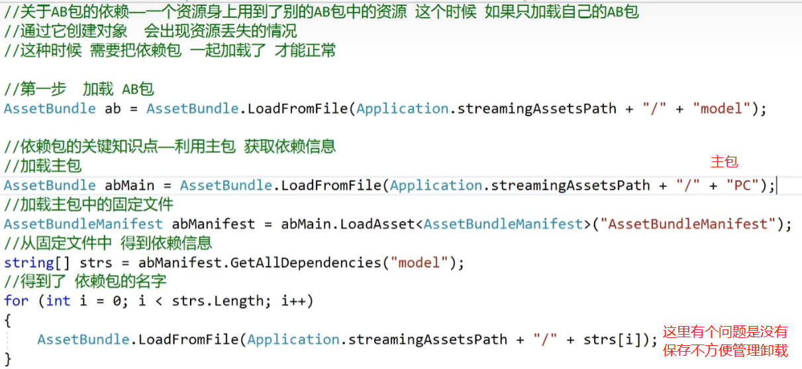

AssetBlundle:是一个存在硬盘的文件，可以称为压缩包，压缩包里面有很多文件，主要分为两类文件：serialized file 和 resource files。（序列化文件和源文件）。
             “AssetBundle”也可以指代通过代码进行交互以便从特定 AssetBundle 存档加载资源的实际 AssetBundle 对象。该对象包含您添加到此存档文件的资源的所有文件路径的映射。

AssetBlundle作用：把可以下载的文件放在AssetBundle中，可以减小包体。

Assetbundle压缩方式：使用LZMA和LZ4压缩算法，减少包大小，更快的进行网络传输。

AssetBundle使用步骤：

1. 指定资源的AssetBundle属性（xxxa/xxx）这里xxxa会生成目录，名字为xxx。’/'可以用于目录划分,Remove UnUsed name 可以移除没有使用的属性名
2. 构建AssetBundle包
3. 上传AB包
4. 加载AssetBundle包和包内资源

代码打包AssetBundle:

```C#
 using UnityEditor;
    using System.IO;    public class CreateAssetBundles
    {
        [MenuItem("Assets/Build AssetBundles")]
        static void BuildAllAssetBundles()
        {
            string dir = "AssetBundles";
            if (Directory.Exists(dir) == false)
            {
                Directory.CreateDirectory(dir);
            }
            //BuildTarget 选择build出来的AB包要使用的平台
            BuildPipeline.BuildAssetBundles(dir, BuildAssetBundleOptions.None, BuildTarget.StandaloneWindows64);
        }
    }
```


压缩方式：


1. dir:bundle路径（随意）
2. BuildAssetBundleOptions

* BuildAssetBundleOptions.None : 使用LZMA算法压缩，压缩的包更小，但是加载时间更长。使用之前需要整体解压。一旦被解压，这个包会使用LZ4重新压缩。
  使用资源的时候不需要整体解压。在下载的时候可以使用LZMA算法，一旦它被下载了之后，它会使用LZ4算法保存到本地上。
*  BuildAssetBundleOptions.UncompressedAssetBundle：不压缩，包大，加载快
* BuildAssetBundleOptions.ChunkBasedCompression：使用LZ4压缩，压缩率没有LZMA高，但是我们可以加载指定资源而不用解压全部。
  注意:使用LZ4压缩，可以获得可以跟不压缩想媲美的加载速度，而且比不压缩文件要小。

    依赖打包：将需要同时加载的资源放在同一个包里，各个包之间会保存相互的依赖关系

Assetbundle加载和卸载（[ab包不能重复加载不然会报错](https://www.bilibili.com/video/BV1LD4y1m7kF/?p=5&spm_id_from=pageDriver&vd_source=ef1db1252fb9dd8731a4cdb51b331323)）【[异步](https://www.bilibili.com/video/BV1LD4y1m7kF/?p=6&spm_id_from=pageDriver&vd_source=ef1db1252fb9dd8731a4cdb51b331323)】
    AB加载 ： 开发阶段AB包存放在本地，开发结束后上传服务器
        1、Assetbundle.LoadFromFile : 从本地加载

```
public class LoadFromLocal : MonoBehaviour
            {
                private void Start()
                {
                    AssetBundle ab = AssetBundle.LoadFromFile("AssetBundles/scene/wall.jy");
                    GameObject obj = ab.LoadAsset 
```

    2、Assetbundle.LoadFromMemory : 从内存中加载

```
            private void Start()
            {
                AssetBundle ab = AssetBundle.LoadFromMemory(File.ReadAllBytes("AssetBundles/scene/cube.jy"));
                GameObject obj = ab.LoadAsset
```


    3、WWW.LoadFromCacheorDownLoad : 下载后放在缓存中备用（该方法逐渐被弃用）

```
 IEnumerator Start()
            {
                while (Caching.ready == false)
                {
                    yield return null;
                }                WWW www = WWW.LoadFromCacheOrDownload(@"file://E:\U3D-Projects\Test2017.2.0\AssetBundles\scene\cube.jy", 1);
                yield return www;
                if (!string.IsNullOrEmpty(www.error))
                {
                    Debug.Log(www.error);
                    yield break;
                }
                AssetBundle ab = www.assetBundle;
                GameObject obj = ab.LoadAsset
```


    4、UnityWebRequest ： 从服务器下载

```
 IEnumerator Start()
            {
                string url = @"file:///E:\U3D-Projects\Test2017.2.0\AssetBundles\scene\cube.jy";
                UnityWebRequest request = UnityWebRequest.GetAssetBundle(url);
                yield return request.SendWebRequest();
                //方式一
                //AssetBundle ab = DownloadHandlerAssetBundle.GetContent(request);
                //方式二
                AssetBundle ab = (request.downloadHandler as DownloadHandlerAssetBundle).assetBundle;
                GameObject obj = ab.LoadAsset
```

    从AB中加载资源：
        1、AssetBundle.LoadAsset(assetName)
        2、AssetBundle.LoadAllAssets() 加载AB包中所有的对象，不包含依赖的包
        3、AssetBundle.LoadAssetAsync() 异步加载，加载较大资源的时候
        4、AssetBundle.LoadAllAssetsAsync() 异步加载全部资源
        5、AssetBundle.LoadAssetWithSubAssets 加载资源及其子资源

    AB的卸载
        减少内存的使用
        有可能导致丢失
        在切换场景，或者确定不使用的时候卸载
        AssetBundle.Unload(true) //卸载AB文件的内存镜像，且包含所有Load创建出来的对象
        AssetBundle.Unload(false) //卸载AB文件的内存镜像，但是除了Load创建出来的对象
        Reources.UnloadAsset(Object) //释放已加载的资源Object
        Resources.UnloadUnusedAssets //卸载所有没有被场景引用的资源对象

*依赖： 如果一个材质球被一个预制体引用 ， 但是材质球没有分包 ， 那么这个材质球将自动被分到与引用预制体一个包 ， 如果材质球和预制体不在同一个包 ， 那么加载预制体之前必须先加载材质球所在的ab包 ， 不然预制体将材质丢失[主包中可以得到依赖]*



*这里也有个缺陷就是，这里的依赖是model这个ab包所有资源的依赖包 ， 不是model里面某个资源的依赖*
